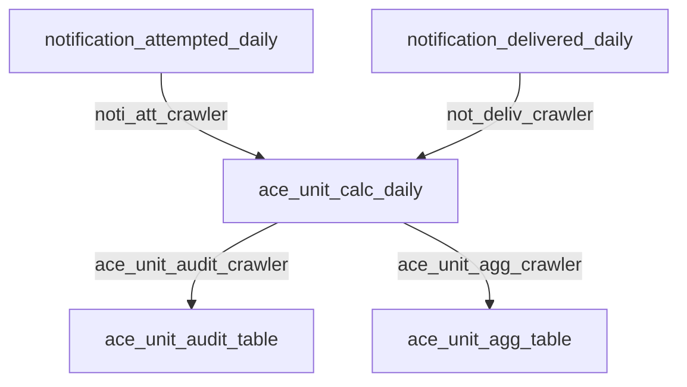

# rn-ace-unit Documenation Page

This repository is for calculating active customer engagement data for billing purposes

To view the RFC, please visit [confluence](https://rn-jira.atlassian.net/wiki/spaces/RT/pages/2253225992/RFC-0072+-+ACE+Unit+Calculation).

### Project Layout

    deploy/             # Contains python file used to deploy files to s3 during Codebuild.
    infrastructure/     # TF files which build and deploy AWS resources during CICD
    pipeline/           # Used by the rn-release-tool to build Codepipeline used to run CICD
    rn/                 # Parent folder
        ace_unit/       # python code used by Glue for ace unit processes
        common/         # shared python modules used by multiple jobs
        datalake/       # python code used by Glue for datalake processes
    tests/              # Files used to run unit tests

### Daily Jobs

#### ace_unit
- Daily job is kicked off at 4:15AM EST.  Both `notification_attempted_daily` and `notification_delivered_daily` and run in parallel.
- `notification_attempted_daily` glue job runs to build `notification_attempted` Athena table.  `notification_attempted_crawler` runs to make new data accessible in Athena.
- `notification_delivered_daily` glue job runs to build `notification_delivered` Athena table.  `notification_delivered_crawler` runs to make new data accessible in Athena.
- After both of the previous jobs have completed successfully, `ace_unit_calc_daily` glue job runs to build `ace_unit_audit_table` and `ace_unit_agg_table` Athena tables.
- `ace_unit_audit_crawler` and `ace_unit_agg_crawler` run to make new data accessible in Athena.
- estimated run time in production: 12 minutes

#### datalake
- `outcome_experience_lookup_daily` glue job is kicked off at 4:15AM EST. This runs to build `outcome_experience_lookup` Athena table which is then deduplicated via the `v_dim_customer` Athena view.  `outcome_experience_lookup_crawler` runs to make new data accessible in Athena. 
- `dim_customer_daily_glue` glue job is kicked off at 4:15AM EST and replicates the `dim_customer` table from the datawarehouse in the datalake.  This involves connecting to Redshift and running an unload statement.  This builds `dim_customer` Athena which is then deduplicated via the `v_dim_customer` Athena view.

### Monthly Jobs
- `ace_unit_monthly_output`: python shell job that runs in Glue.  Job runs at 5AM EST on the first of the month.
    - Job grabs relevant data from `ace_unit_agg_table` in Athena and pushes the data to `com.relaynetwork` s3 bucket for Joe Doran to access.
    - estimated run time in production: 30 seconds
- `ace_unit_monthly_outcome_experience_output`: python shell job that runs in Glue.  Job runs at 5AM EST on the first of the month.
    - Job grabs relevant data from `ace_unit_audit_table` and joins it with `outcome_experience_lookup` in Athena and pushes the data to `com.relaynetwork` s3 bucket for Finance to access.  This is a different view of the data than `ace_unit_monthly_output`.  The data is grouped at a different level and contains additional columns.
    - estimated run time in production: 30 seconds

## Built With

* [AWS Glue](https://docs.aws.amazon.com/glue/latest/dg/what-is-glue.html) - Fully managed ETL framework hosted in AWS
    * https://docs.aws.amazon.com/glue/latest/dg/aws-glue-programming-python-libraries.html
    * Release notes including versions: https://docs.aws.amazon.com/glue/latest/dg/release-notes.html
    * https://docs.aws.amazon.com/glue/latest/dg/migrating-version-30.html#migrating-version-30-appendix-dependencies
* [PySpark](https://spark.apache.org/) - PySpark is an interface for Apache Spark in Python.
* [AWS CodePipeline](https://aws.amazon.com/codepipeline/) - Fully managed continuous delivery service
* [Terraform](https://www.terraform.io/) - Open-source infrastructure as code software tool
* _Add any additional libraries, services, or frameworks used_

## Docker Setup

* Pull the amazon glue Docker image down to your local machine (docker desktop must be installed):
`docker pull amazon/aws-glue-libs:glue_libs_3.0.0_image_01`
* Run your docker image in interactive mode and mount this github repo to it (change folders below as needed to match your local folder setup):
`docker run -it -v /Users/jrose/Documents/Github/rn-ace-unit:/home/glue_user/workspace -v ~/.aws:/home/glue_user/.aws -p 8888:8888 -e DISABLE_SSL=true --rm --name ace_unit_glue amazon/aws-glue-libs:glue_libs_3.0.0_image_01`
* If you want to open a Juptyer Notebook, run the following and then go to `localhost:8888`:
`sh /home/glue_user/jupyter/jupyter_start.sh`

## Versioning

TODO
